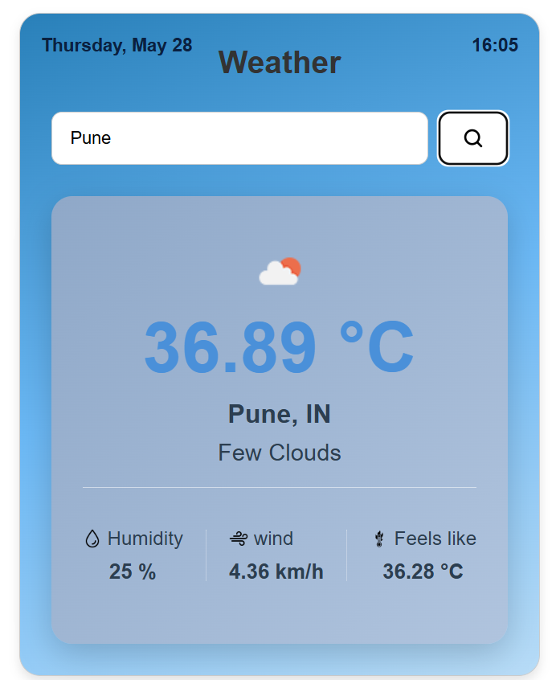

# 🌦️ Advanced Weather App

A modern and responsive Weather Forecast Application built using **HTML**, **CSS**, and **Vanilla JavaScript** with real-time weather data from the **OpenWeather API**.

---

# 🚀 Features

✅ Real-time Weather Data  
✅ Search Weather by City Name  
✅ Dynamic Weather Icons  
✅ Temperature, Humidity & Wind Speed  
✅ Feels Like Temperature  
✅ Live Date & Time  
✅ Time-Based Dynamic Backgrounds  
✅ Weather-Based Card Themes  
✅ Responsive UI Design  
✅ Async/Await API Handling  
✅ Error Handling for Invalid Cities  
✅ Docker Support

---

# 🛠️ Technologies Used

- HTML5
- CSS3
- JavaScript (ES6)
- OpenWeather API
- Docker
- Git & GitHub

---

# 📸 Project Preview



---

# 📂 Project Structure

```bash
weather/
│
├── index.html
├── style.css
├── script.js
├── Dockerfile
├── .dockerignore
└── README.md
```
